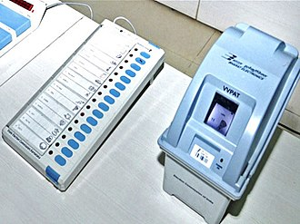
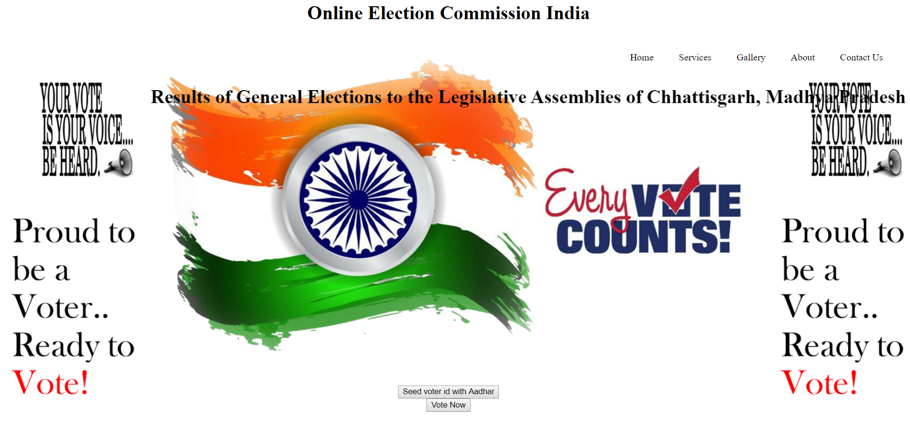

# Online-Voting-System-using-Blockchain

INTRODUCTION :

Elections are believed to be the key pillars of democracy and voting is one of the electoral processes that ensure the sustenance of democracy in any civil society. Online voting is an electronic way of choosing leaders via a web driven application. It  provides a platform for simplifying the electoral process for all institutions that employ voting in decision-making. It is geared towards increasing the voting percentage in Universities and colleges . Since it has been noted that with the old voting method, the voter turnout has been a wanting case. In 2013, It was estimated that about 69 percent of students stayed away from registering to vote.

EXISTING SYSTEM :

Existing System consist of methods like paper ballet voting and EVM voting. In EVM’s there is no transparency, verifiability, accuracy and anonymity. The problem with the present EVMs is election fraud, election manipulation and vote rigging. Government is spending lots of revenue on the EVMs and whole election process which is killing time of the voters in the queues when they have come to cast their vote.

PROPOSED SYSTEM :

Online Voting System using Blockchain, provides user friendly interface for the people of India. According to the previous elections, it was been recorded that the percentage of voting in rural areas is always greater than percentage of voting in urban areas. There might be many problems like, votes getting missed, migration to their hometowns to cast their vote etc. Online voting enables voters to cast their vote privately and easily from any location and on any device with internet access. This enables election officials to assure that their votes remain cast-as-intended , recorded-as-cast and counted-as-recorded. This project provides lot of Anonymity, Accuracy, Verifiability and Transparency. In EVMs, results is a time taking process where all the poll officers should be available before and after the government seal. Whereas in Online Voting, results will be known within a very less time. That is there’s lots of accuracy in this process. This system ensure tamper proof and also ensure that electoral frauds do not happen in the process.

**Face Recognition** :

Face recognition is a biometric software application capable of uniquely identifying or verifying a person by comparing and analyzing patterns based on the person's facial contours. Face recognition is mostly used for security purposes, though there is increasing interest in other areas of use. In fact, face recognition technology has received significant attention as it has potential for a wide range of application related to law enforcement as well as other enterprises.

**Blockchain** :

Through Blockchain the election system can be made more transparent, convenient and difficult to tamper into. The system will also ensure the identity and eligibility of the voter.

To simplify it, blockchain is a chain of digital blocks that contain the records if the information or transactions sent across. According to IBM’s Blockchain blog, any hacker would need to change the block containing the record, along with the ones connected to it to avoid detection, making the blockchain difficult to tamper with.

